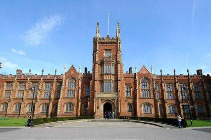

# [Rdatadive2020](https://n8thangreen.wixsite.com/hermes-hack-london) 
__Jan 21 - 22, 2020. Queen's University Belfast__

 
 

Welcome to the repository for the 2020 health economics in R data dive.
Following the first hackathon event at Imperial College London in November 2019 we will be hosting this event at Queens University Belfast.

* Please post ideas for projects, discussion topics, and sessions as [issues](https://github.com/Health-Economics-in-R/Rhackathon19/issues/).

Event hashtag is `#rhack20`

## Code of conduct

To ensure a safe, enjoyable, and friendly experience for everyone who participates, we have a [code of conduct](https://n8thangreen.wixsite.com/hermes-hack-london/code-of-conduct). This applies to people attending in person or remotely, and for interacting over the [issues](https://github.com/Health-Economics-in-R/Rhackathon19/issues/).

## Support

This meeting is made possible by generous support from the Medical Research Council, Imperial College London and Queen's University Belfast.
